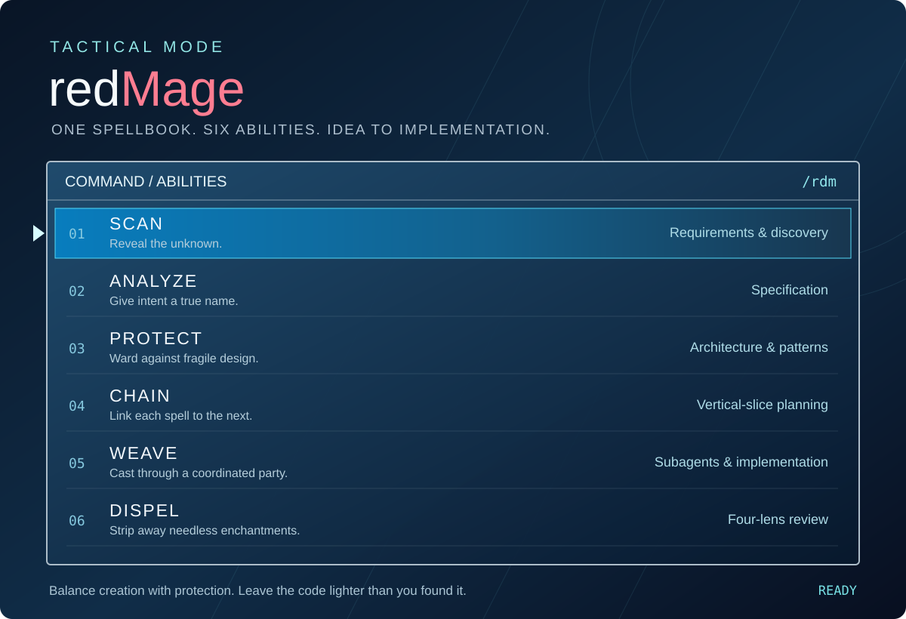

# redMage



**A little creation magic. A little protection magic. One complete spellbook.**

redMage balances the craft of building with the discipline of guarding what matters. Reveal the requirements, shape the plan, summon a coordinated party of agents, and dispel complexity before the final cast. An FFVII-inspired command menu for a workflow that takes an idea through verified implementation.

## Install as a plugin

### Codex

```sh
codex plugin marketplace add justjammin/redMage
codex plugin add redMage@justjammin
```

Start a new task and select `redMage:rdm`. The six phase skills are also available through the skill picker.

### Claude Code

Run inside Claude Code:

```text
/plugin marketplace add justjammin/redMage
/plugin install redMage@justjammin
```

Invoke `/redMage:rdm`, or a phase such as `/redMage:scan`. For a local development session:

```sh
claude --plugin-dir /absolute/path/to/redMage
```

Both plugins share the same bundled skills and references. If the repository is still private, installation requires GitHub access; once public, the same commands work without private-repository credentials.

## Install as a local skill bundle

The package now includes `package.json` and a `redmage` executable. From this checkout:

```sh
npx . --help
npx . install
```

Or from another directory:

```sh
npm install /absolute/path/to/redMage
npx redmage install
```

The executable copies the complete bundle into the current project's `.agents/skills/rdm`. Use `--global` for your personal skills directory, or `--dest /exact/skill/folder` for a custom destination. Existing destinations are preserved; use a fresh destination for testing. No npm lifecycle scripts run, and the executable downloads no dependencies.

This package is available from the checkout/GitHub, not published to the npm registry. Use this installer or the plugin marketplace to retain all sibling skills and shared references; copying `skills/rdm` alone is incomplete. The installer generates its entry from `skills/rdm/SKILL.md`, the single canonical router.

## The spellbook

| Ability | The magic | The work |
|---|---|---|
| **1. Scan** | Reveal what hides in the mist. | Clarify users, functional and non-functional requirements, domain terms, and testing seams. |
| **2. Analyze** | Give intent a true name. | Turn settled decisions into a specification with observable acceptance criteria. |
| **3. Protect** | Raise a ward against fragile design. | Choose file shapes and patterns, then challenge them with evidence. |
| **4. Chain** | Link each spell to the next. | Plan independently testable vertical slices and their dependencies. |
| **5. Weave** | Cast through a coordinated party. | Dispatch scoped subagents, implement, test, and review the result. |
| **6. Dispel** | Strip away needless enchantments. | Review through YAGNI, KISS, DRY, and SOLID; name what can be simplified. |

You steer the important decisions. redMage keeps the spellbook, coordinates the party, and reports what passed verification.

The plugin manifest exposes the phase skills when loaded as a plugin. The npx installer installs the single `rdm` bundle; the workflow loads its phases through relative paths rather than requiring separately registered commands.

## Local workflow artifacts

Each phase saves its working documents under `.mage/` in the target project:

| Phase | Output |
|---|---|
| Scan | `.mage/scan/<slug>.md`, `.mage/CONTEXT.md`, `.mage/adr/` |
| Analyze | `.mage/analyze/<slug>.md` |
| Protect | `.mage/protect/<slug>.md` |
| Chain | `.mage/chain/<slug>.md` |
| Weave | `.mage/weave/<slug>.md` |
| Dispel | `.mage/dispel/<slug>.md` |

Use the same feature slug across phases. Keep `/.mage/` ignored by Git so decisions, plans and review evidence remain local. Product source, tests and explicitly requested shipped documentation stay in their normal project locations. Existing project knowledge remains readable without being moved or rewritten.

Start with the selected skill; no setup script or Python prerequisite is required. Use the host's available tools and follow the target project's instructions. Weave requires host subagent support for independent implementation and review.

## Development checks

Run `npm test` to verify bundle installation, relative phase references and preservation of existing destinations. These are maintainer tests, not a user startup step.
