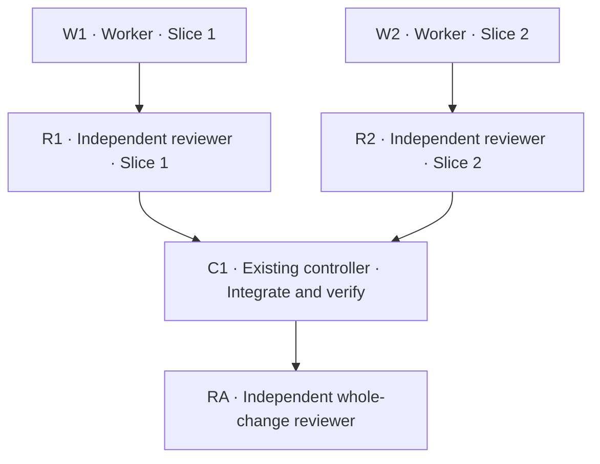

# Agent DAG in PLAN.md

The DAG describes future execution, not agent dispatch. Each slice has a worker and an independent reviewer. A reviewer may evaluate both Spec and Standards, reporting the axes separately. The controller owns integration and verification; the whole-change reviewer is independent of implementation.

Use stable IDs in both the Mermaid graph and assignment table. Review nodes own no source files. Each edge requires successful completion evidence; a returned worker or an exhausted review budget does not satisfy it. A failed gate blocks downstream nodes.

## Worked example: two independent slices

Illustrative paths and assignments only. Replace them with the actual plan's slices and exact files. Parallel execution here is justified by disjoint ownership and settled interfaces.

| ID | Role / slice | Responsibility | Owned paths / read-only scope | Prerequisites | Completion evidence |
|---|---|---|---|---|---|
| W1 | Worker / 1 | Deliver task creation | `src/create.ts`, `tests/create.test.ts` | Settled spec, design and interfaces | Scoped commit, acceptance tests and actual results |
| R1 | Reviewer / 1 | Review Spec and Standards | W1 diff and relevant context; no source writes | W1 | Separate axis results; required findings resolved |
| W2 | Worker / 2 | Deliver task listing | `src/list.ts`, `tests/list.test.ts` | Settled spec, design and interfaces | Scoped commit, acceptance tests and actual results |
| R2 | Reviewer / 2 | Review Spec and Standards | W2 diff and relevant context; no source writes | W2 | Separate axis results; required findings resolved |
| C1 | Existing controller | Integrate and verify | Combined change and applicable project checks | R1, R2 | Integrated code identity; full-suite, lint/build/type and applicable NFR results |
| RA | Whole-change reviewer | Review integrated Spec and Standards | Integrated diff; no source writes | C1 | Separate axis results; required findings resolved |

Assignments: two workers and three reviewers, plus the existing controller. Planned peak subagent concurrency: two. Each worker exits before its reviewer starts; the controller serializes commit slots in a shared checkout. Correction rounds reuse the assigned worker/reviewer roles and do not imply additional parallel slots.

**Stop after Weave:** save `RESULTS.md` and report complexity review pending. Dispel is a separate, user-invoked required checkpoint; it is not a dispatched node or an automatic edge from RA.

## Dependency variations

- **Linear dependency:** if slice 2 consumes slice 1, add `R1 --> W2` and give W2 prerequisite R1 in the table. Use peak concurrency one for this serial schedule.
- **Shared files:** if the slices touch the same source or test file, order them with `R1 --> W2` and record the serialized ownership in the table. Do not draw parallel branches for overlapping ownership.
- **Correction rounds:** keep retries in prose, not backward graph edges. Initial acceptance releases the gate immediately; otherwise allow at most two correction/re-review rounds. Acceptance after either releases it; required findings after round two leave it blocked. Tests and independent re-review remain required in each round.

Counts describe planned assignments, not guaranteed distinct processes or total retry launches. Host limits may reduce concurrency; they cannot bypass review gates. Reconcile contract, ownership or dependency changes with the plan before dependent dispatch.
