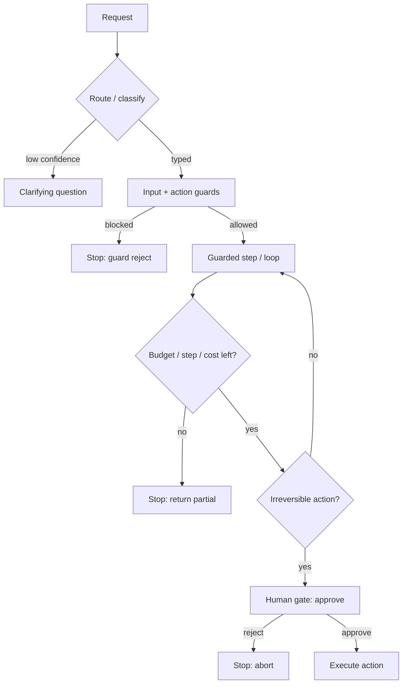

# Agentic Control

Load this catalog only when ticket signals match this domain. A pattern name is a candidate, not a verdict.

## `routing`: Routing

| Judge field | Guidance |
|---|---|
| Pressure | Inputs split into distinct types needing different handling; mega-prompt degrading or cost too high. |
| Valid use | Clear categories map to specialist prompts/models; cheap-vs-expensive routing cuts cost. |
| Reject when | Categories few/overlapping; one prompt handles all without measured degradation. |
| Failure modes | Ambiguous inputs, classifier drift, lost context on handoff, miss-route to wrong specialist. |
| Required evidence | Category distribution, misroute rate, cost delta per model, classifier confusion matrix. |
| Adversarial questions | What is the misroute rate, and what happens to a request the classifier gets wrong? |
| Simpler default | One prompt until a category proves it needs separate handling. |
| Tests | Per-category routing tests, low-confidence-to-clarify tests, adversarial ambiguous-input tests. |
| Operations | Route distribution, misroute/fallback rate, per-route cost and latency. |
| ELI5 | Send each question to the helper who knows that thing; ask again if you're not sure. |

## `human-in-the-loop`: Human-in-the-loop

| Judge field | Guidance |
|---|---|
| Pressure | An irreversible or expensive action would run with no human confirmation. |
| Valid use | Gating payments, deletions, sends until production evidence earns relaxed gates. |
| Reject when | Action is cheap and reversible; gate adds latency for no risk reduction. |
| Failure modes | Gate fatigue (rubber-stamping), stalled runs, checkpoint/resume state loss, needless gating of reversible actions. |
| Required evidence | Action reversibility/cost, gate wait time, approval-vs-reject ratio, resume-after-days proof. |
| Adversarial questions | Is this action actually irreversible, or are you gating it out of habit? |
| Simpler default | Gate only irreversible/expensive actions; auto-proceed on reversible ones. |
| Tests | Checkpoint/resume tests (incl. days-later), gate-triggers-on-irreversible tests, reject-path tests. |
| Operations | Gate wait time, approval rate, rubber-stamp rate, stalled/abandoned runs. |
| ELI5 | Before doing something you can't undo, stop and ask a grown-up. |

## `guardrails`: Guardrails

| Judge field | Guidance |
|---|---|
| Pressure | Always-on in production; question is whether guards are present, adequate, and unbypassable. |
| Valid use | Input (injection/PII/off-topic), action (permissions/budgets/rate/allow-list), output (policy/format/grounding) guards, run in parallel. |
| Reject when | A guard is theater (checks nothing enforceable) or duplicates an upstream control. |
| Failure modes | Guard bypass, false sense of safety, latency if serial, over-blocking legit input. |
| Required evidence | Guard coverage per layer, block/false-positive rate, bypass attempts caught, serial-vs-parallel latency. |
| Adversarial questions | Which guard is missing, and how would an attacker route around the ones present? |
| Simpler default | Keep guards cheap, parallel, enforceable; drop decorative checks. |
| Tests | Injection/PII red-team tests, permission/budget denial tests, output-policy and grounding tests, bypass tests. |
| Operations | Block rate per guard, false-positive rate, bypass incidents, added latency. |
| ELI5 | Guards stand at the doors checking what goes in and out, all at once. |

## `state-machines-graphs`: State machines and graphs

| Judge field | Guidance |
|---|---|
| Pressure | Control flow is hidden, untestable, or can't resume after failure. |
| Valid use | Explicit nodes/edges make flow visible, testable, resumable; cycles give loops, conditional edges give routing/reflection. |
| Reject when | Task is linear; a plain loop or straight sequence is clearer. |
| Failure modes | Over-engineered graph for linear work, rigid graph fighting emergent needs, state/transition sprawl. |
| Required evidence | Actual branching/loops present, resume requirement, count of real transitions vs ceremony. |
| Adversarial questions | Does this task branch or loop at all, or are you drawing a graph for a straight line? |
| Simpler default | Straight sequence or single loop until branching/resume is real. |
| Tests | Illegal-transition tests, resume-from-node tests, conditional-edge coverage tests. |
| Operations | Node/transition frequency, stuck-state rate, resume success rate. |
| ELI5 | Draw a map of the steps so you always know where you are and can start again. |

## `termination-budgets`: Termination and budgets

| Judge field | Guidance |
|---|---|
| Pressure | Always-on in production; every loop must have stop conditions and a defined partial return. |
| Valid use | Max steps, token budget, wall-clock timeout, cost ceiling, repeated-call detection, defined partial result. |
| Reject when | Essentially never for a production loop; missing budgets on an unbounded loop is a P0/P1 risk. |
| Failure modes | Runaway loops, cost blowout, no partial result on cutoff, silent infinite retry. |
| Required evidence | Configured limits per axis, observed step/token/cost distribution, partial-result path, repeat-detection logic. |
| Adversarial questions | Which stop condition fires first on a stuck run, and what does the caller get back? |
| Simpler default | Set every limit and a partial return before shipping any loop. |
| Tests | Budget-exceeded tests per axis, repeated-call detection tests, partial-result-on-cutoff tests. |
| Operations | Steps/tokens/cost per run, cutoff-trigger rate, runaway/timeout incidents. |
| ELI5 | Give the robot a timer and a coin jar so it always stops and tells you what it got. |
