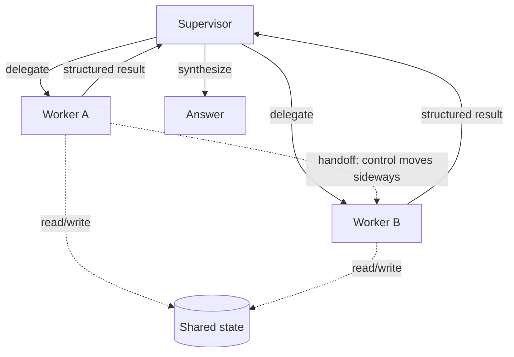

# Agentic Coordination

Load this catalog only when ticket signals match this domain. A pattern name is a candidate, not a verdict.

## `multi-agent-supervisor`: Multi-agent / supervisor-worker

| Judge field | Guidance |
|---|---|
| Pressure | One context window can't hold the task, or separable subtasks need different tools/models. |
| Valid use | Independent subtasks that parallelize and merge into a clean synthesis. |
| Reject when | A single agent with the right tools fits one context window. |
| Failure modes | Coordination overhead, conflicting worker outputs, error amplification, opaque debugging. |
| Required evidence | Token/context budget per path, subtask independence, tool/model divergence, parallel speedup. |
| Adversarial questions | Why can't one agent do this? What synthesizes conflicts, and by what rule? |
| Simpler default | One agent; or static `parallelization` with a fixed fan-out. |
| Tests | Multi-agent trajectory tests, worker-conflict injection, synthesis-correctness evals. |
| Operations | Per-worker latency/cost, fan-out width, retry/error rates, synthesis reject rate. |
| ELI5 | A boss splits the chore so helpers each do a piece at once. |

## `handoffs-swarms`: Handoffs and swarms

| Judge field | Guidance |
|---|---|
| Pressure | Conversational flow must move between specialists without a central manager. Cost: Medium. |
| Valid use | Triage-to-specialist routing where lighter wiring than a supervisor is enough. |
| Reject when | You need central oversight/auditing of the flow — use a supervisor. |
| Failure modes | Sideways control is hard to observe, loops between agents, context lost/duplicated on handoff. |
| Required evidence | Routing map, handoff payload contract, loop bounds, audit requirement (present or absent). |
| Adversarial questions | Who owns the conversation now? What stops A→B→A ping-pong? What survives the handoff? |
| Simpler default | Supervisor with explicit delegation, or a single agent with a routing prompt. |
| Tests | Handoff-loss injection, loop-detection tests, trajectory tests across specialist chains. |
| Operations | Handoff counts, loop/cycle detection, per-hop context size, dead-end rate. |
| ELI5 | One kid hands the whole story to the next kid to keep going. |

## `hierarchical-agents`: Hierarchical agents

| Judge field | Guidance |
|---|---|
| Pressure | A single supervisor's context is overwhelmed by worker count or output size. Cost: Very high. |
| Valid use | Rare — worker fan-out so large one manager can't hold results; almost never >2 levels. |
| Reject when | A flat supervisor-worker still fits. |
| Failure modes | Latency/cost multiplication, deep error propagation, extreme debugging, telephone-game context loss. |
| Required evidence | Proof one supervisor overflows, per-level budget, fidelity loss per hop, depth justification. |
| Adversarial questions | Why won't a flat tree work? What does each extra level buy vs. the fidelity it costs? |
| Simpler default | Flat supervisor-worker; shrink/summarize worker outputs before adding a level. |
| Tests | Deep-trajectory tests, cross-level context-loss injection, error-propagation evals. |
| Operations | Cumulative latency/cost per level, depth, error blast radius, context-shrink ratio per hop. |
| ELI5 | A boss over bosses over helpers — most jobs don't need that many bosses. |

## `blackboard`: Blackboard and shared state

| Judge field | Guidance |
|---|---|
| Pressure | Many agents must extend a shared typed state and act when their conditions appear. Cost: Medium. |
| Valid use | Decoupled agents that read/write shared state; easy to add new watchers. Graph frameworks fit here. |
| Reject when | A small fixed set of agents with explicit handoffs is clearer. |
| Failure modes | Hidden write races, ordering ambiguity, unbounded state growth, who-owns-what confusion. |
| Required evidence | State schema, per-field owner/writer map, ordering guarantees, size bounds, watcher count. |
| Adversarial questions | Who may write this field? What if two write at once? What caps state size? |
| Simpler default | A small fixed agent set with explicit handoffs and a passed payload. |
| Tests | Concurrent-write race injection, ordering-permutation tests, state-growth/bounds evals. |
| Operations | Shared-state size over time, write-conflict counts, per-field write frequency, watcher fan. |
| ELI5 | Everyone writes on one whiteboard and jumps in when they see their cue. |

## `debate-consensus`: Debate and consensus

| Judge field | Guidance |
|---|---|
| Pressure | High-stakes contested analysis where accuracy justifies 2-4x cost. Cost: High. |
| Valid use | Opposing or independent passes reconciled by a judge to raise factual accuracy. |
| Reject when | A single well-prompted pass or one reviewer suffices. |
| Failure modes | Cost multiplier, agents converge on shared bias, weak judge, verbose non-terminating debate. |
| Required evidence | Accuracy lift vs. single pass, judge-quality eval, termination rule, bias-independence check. |
| Adversarial questions | Does debate actually beat one pass here? Is the judge stronger than the debaters? When does it stop? |
| Simpler default | One well-prompted pass, or a single reviewer critiquing one draft. |
| Tests | Judge-quality evals, shared-bias/convergence injection, round-cap termination tests. |
| Operations | Cost multiplier, round counts, judge override rate, non-termination/timeout rate. |
| ELI5 | Two kids argue both sides and a referee picks the best answer. |
