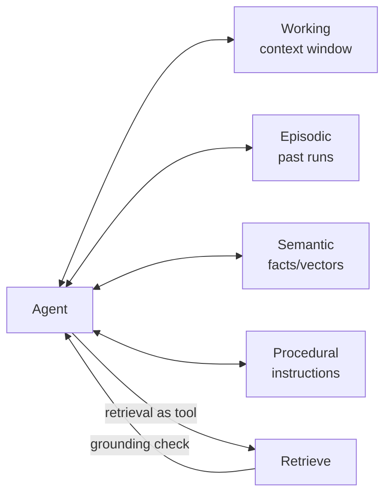

# Agentic Knowledge

Load this catalog only when ticket signals match this domain. A pattern name is a candidate, not a verdict.

## `memory`: Memory

| Judge field | Guidance |
|---|---|
| Pressure | Agent must stay useful across sessions; working context alone forgets everything. |
| Valid use | Cross-run value exists — facts, past outcomes, or procedures worth persisting and reusing. |
| Reject when | Single-session task with no cross-run value; working context is enough. |
| Failure modes | Write bugs dominate — saving everything (noise/cost/leakage) or nothing useful; stale/contradictory memories; retrieval pulls irrelevant context; PII retention. |
| Required evidence | Which memory type, what gets written and when, read/relevance path, retention and eviction policy. |
| Adversarial questions | What exactly gets written, on what trigger? What gets read back and why is it relevant? Who evicts stale/contradictory entries? Where does PII go? |
| Simpler default | Keep it all in the working context window. |
| Tests | Write-correctness tests (right entry, right trigger, no dupes), staleness/contradiction checks, retrieval-relevance evals, PII-retention scans. |
| Operations | Memory size/growth, write/read rates, stale-entry ratio, retrieval count per answer, leakage/PII incidents. |
| ELI5 | Remember only the few things worth remembering, not every word you heard. |

## `agentic-rag`: Agentic RAG

| Judge field | Guidance |
|---|---|
| Pressure | Answers must be grounded in your data and static one-shot retrieval keeps returning confident wrong answers. |
| Valid use | Agent controls retrieval — rewrites query, decides whether/where to retrieve, grades relevance, retrieves again if weak, answers with citations plus grounding check. Cost: Medium. |
| Reject when | Static one-shot retrieval already grounds answers; no need for agentic control. |
| Failure modes | Ungrounded/hallucinated citations, retrieval loops, latency/cost from repeated retrieval, relevance-grader miscalibration. |
| Required evidence | Query-rewrite step, retrieve/skip decision, relevance grader with threshold, retry cap, citation-to-source binding. |
| Adversarial questions | Does every claim cite a retrieved source? What caps retrieval loops? Is the relevance grader calibrated or a guess? What does one-shot RAG miss that justifies the cost? |
| Simpler default | Plain single-shot RAG or direct lookup. |
| Tests | Grounding/citation evals (claim ↔ source), relevance-grader calibration set, loop-bound tests, cost/latency-per-answer budget checks. |
| Operations | Retrieval count per answer, grounding-check pass rate, citation-validity rate, retry-loop frequency, p95 latency and token cost. |
| ELI5 | Look it up, check it's the right page, then answer — and show where you found it. |

## `context-compaction`: Context compaction

| Judge field | Guidance |
|---|---|
| Pressure | Runs are long and the window fills; raw history crowds out room to work. |
| Valid use | Summarize older turns into compact state (goal, decisions, open questions, key facts, touched resources), drop raw history, keep recent messages; full history stored externally for on-demand retrieval. Cost: Low. |
| Reject when | Runs comfortably fit the window. |
| Failure modes | Lossy summary drops a needed fact, summarization cost/latency, irreversibly discarding raw history, summary drift over repeated compactions. |
| Required evidence | What the summary must preserve, where full history is stored, retrieval path back to raw, compaction trigger threshold. |
| Adversarial questions | Which fact could the summary drop and break the run? Is raw history recoverable or gone for good? How much drift accumulates over N compactions? What triggers compaction? |
| Simpler default | Keep full history until near the limit. |
| Tests | Compaction fact-retention tests (needed facts survive), raw-history recoverability checks, drift evals across repeated compactions. |
| Operations | Context-window utilization, compaction frequency, post-compaction fact-retention rate, summarization latency/cost, raw-history retrieval rate. |
| ELI5 | Write down the important parts, keep the last few pages, and file the rest in a drawer you can open later. |
