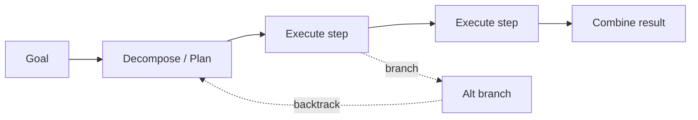

# Agentic Reasoning

Load this catalog only when ticket signals match this domain. A pattern name is a candidate, not a verdict.

## `planning`: Planning

| Judge field | Guidance |
|---|---|
| Pressure | Goal has knowable shape up front, steps with dependencies, or a user who must approve before execution. |
| Valid use | Ordered decompose+execute with re-plan on failure when the DAG is real and shared. |
| Reject when | Few emergent steps; a plain react loop discovers the path cheaper than pre-planning it. |
| Failure modes | Over-planning, stale plans after the world moves, vague steps, context lost between planner and executor. |
| Required evidence | Step count, dependency graph, approval requirement, how often reality diverges mid-run. |
| Adversarial questions | Can you name the steps before running? What invalidates the plan halfway, and who notices? |
| Simpler default | `tool-use-react` loop; let the next step emerge from the last observation. |
| Tests | Trajectory eval on plan quality; re-plan-on-failure injection; stale-plan divergence cases. |
| Operations | Steps per run, re-plan rate, plan-vs-actual drift, tokens spent planning vs doing. |
| ELI5 | Write the to-do list first, but only when you already know the whole list. |

## `plan-and-execute-rewoo`: Plan-and-execute / ReWOO

| Judge field | Guidance |
|---|---|
| Pressure | Predictable tool sequence at scale where model calls dominate the token bill. |
| Valid use | Write full plan with tool calls and result placeholders up front; worker runs all calls; solver combines — one plan call, one solve call. |
| Reject when | Any step depends on a prior observation; placeholders can't adapt, so the saving buys wrong answers. |
| Failure modes | Placeholder plan wrong when reality diverges; zero mid-run correction; solver papers over bad evidence. |
| Required evidence | Fraction of steps that are observation-independent; token cost of react baseline vs ReWOO. |
| Adversarial questions | Does any tool argument come from an earlier result? Then how does a frozen plan survive it? |
| Simpler default | `planning` with per-step observation, or a react loop if adaptation matters more than tokens. |
| Tests | Divergence injection (change reality between plan and execute); placeholder-resolution correctness. |
| Operations | Model calls per task, token cost per run, placeholder-mismatch failure rate. |
| ELI5 | Guess every question up front so you only bother the smart friend twice. |

## `reflexion`: Reflexion

| Judge field | Guidance |
|---|---|
| Pressure | Repeatable task with a crisp reward signal that a single session can retry and improve on. |
| Valid use | After a failed attempt, write a short verbal reflection, store it, re-inject next attempt — self-improvement without weight updates. |
| Reject when | No clean success/failure signal to reflect against; reflection reflects on noise. |
| Failure modes | Reflections drift or mislead, memory bloat, overfitting to one trajectory's quirks. |
| Required evidence | Reward definition, retry budget, measured pass-rate lift across attempts. |
| Adversarial questions | What exactly counts as failure here? Does attempt N+1 actually beat N, or just cost more? |
| Simpler default | Stateless retry, or plain `reflection` without persisted episodic memory. |
| Tests | Reward-signal validity check; across-attempt improvement eval; memory-poisoning injection. |
| Operations | Attempts per solve, pass-rate by attempt number, reflection memory size. |
| ELI5 | After you get it wrong, write yourself a sticky note so you don't repeat it. |
| Relation | = `reflection` (see agentic-workflow) + episodic `memory` (see agentic-knowledge). |

## `tree-of-thoughts`: Tree of Thoughts and search

| Judge field | Guidance |
|---|---|
| Pressure | One wrong step is expensive AND the option set is narrow enough to enumerate and score. |
| Valid use | Generate candidate next steps, evaluate, expand the best, backtrack on dead branches; ToT over steps, LATS over full trajectories via MCTS. |
| Reject when | Linear reasoning already solves it, or the branching factor makes cost explode. |
| Failure modes | Combinatorial blowup, weak state evaluator picking bad branches, latency users won't wait through. |
| Required evidence | Cost of a wrong step, branching factor, quality of the evaluator, latency budget. |
| Adversarial questions | Can your evaluator actually rank branches? What is the cost multiple over a straight line? |
| Simpler default | Single-path chain-of-thought; add self-consistency voting before you reach for search. |
| Tests | Evaluator calibration eval; branch-count vs accuracy sweep; latency ceiling test. |
| Operations | Nodes expanded per task, cost multiple vs baseline, p95 latency, evaluator error rate. |
| Note | LATS is folded under this card. |
| ELI5 | Try a few moves in your head, keep the best, undo the ones that lead nowhere. |

## `self-ask`: Self-ask and decomposition

| Judge field | Guidance |
|---|---|
| Pressure | Multi-hop question whose answer depends on chaining facts the model must fetch in order. |
| Valid use | Model asks itself follow-up sub-questions before the main one, each optionally firing a tool call — planning inside one prompt. |
| Reject when | Single-hop lookup; decomposition only adds tokens without surfacing new information. |
| Failure modes | Wrong decomposition, hallucinated sub-answers that propagate into the final answer. |
| Required evidence | Hop count, whether sub-answers need tools, accuracy vs direct answer. |
| Adversarial questions | Does answering need more than one fact? Are the sub-answers grounded or invented? |
| Simpler default | Direct answer, or a single retrieval call. |
| Tests | Multi-hop QA eval; sub-answer grounding check; single-hop-doesn't-decompose test. |
| Operations | Sub-questions per query, tokens per answer, sub-answer hallucination rate. |
| ELI5 | Ask yourself the little questions first, then answer the big one. |

## `code-as-action`: Code as action (CodeAct)

| Judge field | Guidance |
|---|---|
| Pressure | Many tool calls, loops, or real computation per task, as in coding and data-analysis agents. |
| Valid use | Agent writes a program that calls tools, loops, branches, computes, then runs it in a sandbox; errors returned for repair. |
| Reject when | One or two discrete tool calls suffice; sandbox risk buys nothing. |
| Failure modes | Sandbox escape / security, runaway loops, opaque failures buried in program output. |
| Required evidence | Tool calls per task, need for loops/computation, sandbox with resource limits in place. |
| Adversarial questions | Where does the code run, and what stops it eating the host? How many calls does one task really need? |
| Simpler default | One-at-a-time JSON tool calls in a react loop. |
| Tests | Sandbox-escape red-team; resource-limit / runaway-loop injection; error-repair loop eval. |
| Operations | Tool calls per program, sandbox failure/timeout rate, CPU/mem per run, escape attempts blocked. |
| ELI5 | Instead of asking one thing at a time, write a little script and run it in a safe box. |
