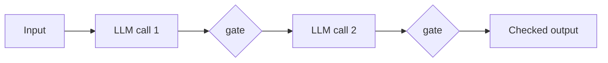

# Agentic Workflow

Load this catalog only when ticket signals match this domain. A pattern name is a candidate, not a verdict.

## `tool-use-react`: Tool use / ReAct

| Judge field | Guidance |
|---|---|
| Pressure | Task needs live info or actions the model lacks; next step depends on last result. |
| Valid use | Step count small and unknown (<10) and each observation changes the plan. |
| Reject when | Steps are fixed and known, or no external observation is needed. |
| Failure modes | Infinite loops, tool hallucination, context bloat, wrong tool choice. |
| Required evidence | Trajectory logs showing observations that actually altered the next action. |
| Adversarial questions | Does any step read a result the model could not predict beforehand? |
| Simpler default | One LLM call, or a fixed prompt chain when no live observation is needed. |
| Tests | Trajectory tests, tool-call fixtures, step-cap and loop-detection tests. |
| Operations | Loop counts, steps per task, tool-call error rate, tokens/cost per run. |
| ELI5 | The robot tries something, looks at what happened, then decides its next move. |

## `prompt-chaining`: Prompt chaining

| Judge field | Guidance |
|---|---|
| Pressure | One call does too many jobs and quality drops; intermediate output must be checked. |
| Valid use | Fixed sequence where a programmatic gate between steps catches errors early. |
| Reject when | The task is one easy job or the extra latency buys no measurable accuracy. |
| Failure modes | Error compounding across steps, latency stacking, brittle gates. |
| Required evidence | Per-step accuracy deltas showing the split beats one call; gate hit rate. |
| Adversarial questions | Which gate actually rejects bad intermediate output, and how often? |
| Simpler default | One well-structured call. |
| Tests | Per-step eval sets, gate-rejection tests, end-to-end regression on the chain. |
| Operations | Per-step latency, gate reject rate, total tokens/cost, drop-off per stage. |
| ELI5 | Do it in small steps and check your work before moving to the next one. |

## `parallelization`: Parallelization — sectioning and voting

| Judge field | Guidance |
|---|---|
| Pressure | Work splits into independent pieces, or a high-stakes call needs variance reduced. |
| Valid use | Genuinely independent sub-parts (sectioning) or best/majority-of-N on risky calls (voting). |
| Reject when | Pieces are coupled, or one pass is already reliable enough for the stakes. |
| Failure modes | False independence, merge conflicts, N-times cost, correlated/systematic errors. |
| Required evidence | Proof of independence; variance/accuracy gain from N vs 1 at the N-times cost. |
| Adversarial questions | Are the runs independent enough that voting fixes anything but noise? |
| Simpler default | Single pass. |
| Tests | Independence checks, merge-conflict cases, vote-tally and tie-break tests. |
| Operations | Fan-out width, tokens/cost multiplier, vote agreement rate, merge failures. |
| ELI5 | Split the work among helpers, or ask a few and go with what most of them say. |

## `orchestrator-workers`: Orchestrator-workers

| Judge field | Guidance |
|---|---|
| Pressure | Shape and count of subtasks depend on the input and are unknown until runtime. |
| Valid use | A central model must decide the split live and spawn a worker per discovered piece. |
| Reject when | The split is known or small — that is static parallelization, not this. |
| Failure modes | Coordination overhead, conflicting worker outputs, error amplification, hard debugging. |
| Required evidence | Inputs where the split genuinely varies; cost of coordination vs a single agent. |
| Adversarial questions | Why can't the split be decided ahead of time and run statically? |
| Simpler default | Static `parallelization`, or one agent when the split is known and small. |
| Tests | Dynamic-split trajectory tests, worker-conflict injection, orchestrator-failure cases. |
| Operations | Worker count per run, coordination retries, aggregate tokens/cost, conflict rate. |
| ELI5 | A boss looks at the job, then decides how many helpers to hire on the spot. |

## `reflection`: Reflection / critic

| Judge field | Guidance |
|---|---|
| Pressure | Output quality matters more than latency and mistakes are cheap to catch pre-delivery. |
| Valid use | Success is expressible as checkable criteria a critic can loop against until it passes. |
| Reject when | A simple validation check suffices, or "quality" has no expressible criteria. |
| Failure modes | Sycophantic critic that rubber-stamps, endless revision, criteria drift, cost. |
| Required evidence | Criteria definition; measured quality lift per revision; retry-cap enforcement. |
| Adversarial questions | Does the critic ever actually reject, or does it approve on the first pass? |
| Simpler default | A single generation with a validation check. |
| Tests | Critic-reject eval set, revision-cap tests, criteria-regression tests. |
| Operations | Revision counts, critic reject rate, pass-after-N distribution, tokens/cost per run. |
| ELI5 | Write it, have a checker point out mistakes, fix them until it's good. |

## `evaluator-optimizer`: Evaluator-optimizer

| Judge field | Guidance |
|---|---|
| Pressure | Clear objective rubric exists and iteration measurably improves the output. |
| Valid use | A separate dedicated evaluator scores each draft and the generator loops until it passes. |
| Reject when | The same generator can self-check cheaply (use plain `reflection`), or no objective rubric exists. |
| Failure modes | Evaluator/generator collusion, rubric gaming, unbounded loops. |
| Required evidence | The rubric; independence of evaluator from generator; measured lift per iteration. |
| Adversarial questions | Why does the evaluator need to be a separate model instead of a self-check? |
| Simpler default | Plain `reflection`, or one generation plus a test/assertion. |
| Tests | Held-out rubric eval, evaluator-independence tests, loop-cap and gaming-injection tests. |
| Operations | Iterations to pass, evaluator score trend, tokens/cost per run, loop-cap hits. |
| ELI5 | A judge grades your work against a rubric and you keep fixing it until you pass. |
