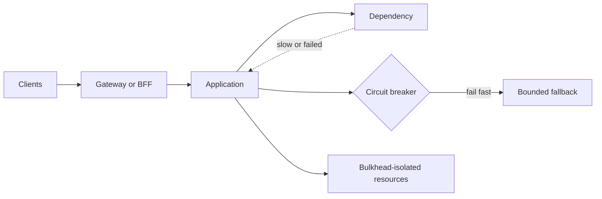

# Architecture and Resilience

Load this catalog only when ticket signals match this domain. A pattern name is a candidate, not a verdict.

## `api-gateway`: API Gateway

| Judge field | Guidance |
|---|---|
| Pressure | Many clients need one controlled entry point for routing or cross-cutting policy. |
| Valid use | Multiple services and clients need consistent auth, rate limits, routing, or protocol translation. |
| Reject when | One service, one client, or a framework router already supplies the boundary. |
| Failure modes | Central bottleneck, broad blast radius, policy drift, hidden latency, oversized gateway. |
| Required evidence | Client/service inventory, policy ownership, latency budget, HA design, bypass rules. |
| Adversarial questions | Which concern must be central, and what survives a gateway outage? |
| Simpler default | Direct service endpoint or existing ingress/router. |
| Tests | Route/auth policy tests; timeout, overload, and gateway-loss tests. |
| Operations | Per-route latency/errors, saturation, config rollout, ownership and failover. |
| ELI5 | One guarded front door can help; making every room depend on one fragile lock cannot. |

## `service-discovery`: Service Discovery

| Judge field | Guidance |
|---|---|
| Pressure | Service instances change addresses dynamically and callers cannot use stable endpoints. |
| Valid use | Autoscaled or ephemeral instances need registration, health filtering, and lookup. |
| Reject when | Addresses are static or the platform already provides a stable service name. |
| Failure modes | Stale registrations, split control planes, lookup latency, unhealthy endpoint selection. |
| Required evidence | Instance churn, platform capability, TTL/health semantics, DNS or registry failure plan. |
| Adversarial questions | Who removes a dead instance, and how stale may discovery be? |
| Simpler default | Platform DNS, load balancer, or static configuration. |
| Tests | Register/deregister, stale entry, partition, and registry outage tests. |
| Operations | Registry health, lookup failures, stale-entry age, change audit. |
| ELI5 | Use a live address book only when helpers keep moving. |

## `circuit-breaker`: Circuit Breaker

| Judge field | Guidance |
|---|---|
| Pressure | Remote failures or slowness consume resources and cascade through callers. |
| Valid use | A dependency has persistent or overload failures where failing fast protects a bounded caller budget. |
| Reject when | Local calls, rare traffic, platform protection, or ordinary bounded retries are enough. |
| Failure modes | Bad thresholds, synchronized half-open probes, false opens, unsafe fallback, hidden outage. |
| Required evidence | Timeout/error history, retry policy, concurrency budget, fallback semantics, SLO impact. |
| Adversarial questions | Which failures trip it, and does the fallback preserve correctness? |
| Simpler default | Strict timeout plus limited retry with jitter, or no retry. |
| Tests | State transitions, slow dependency, recovery probe, fallback correctness, concurrency tests. |
| Operations | Open/half-open counts, rejected calls, dependency latency, manual override/runbook. |
| ELI5 | Stop knocking on a broken door, but check carefully before reopening it. |

## `backend-for-frontend`: Backend for Frontend

| Judge field | Guidance |
|---|---|
| Pressure | Different client types need materially different aggregation, latency, or release boundaries. |
| Valid use | Mobile, web, or partner clients have independent contracts and dedicated ownership. |
| Reject when | Differences are cosmetic, one API can negotiate fields, or no team owns each BFF. |
| Failure modes | Duplicated business logic, divergent rules, extra hops, version sprawl. |
| Required evidence | Client-specific payload/latency data, ownership, contract differences, duplication budget. |
| Adversarial questions | What cannot be solved by a shared API or query shape? |
| Simpler default | Shared API with explicit fields, pagination, or client adapters. |
| Tests | Per-client contract, auth, aggregation failure, and compatibility tests. |
| Operations | Latency by client, duplicated-rule audit, dependency fan-out, release cadence. |
| ELI5 | Give different-sized menus only when diners truly need different meals. |

## `bulkhead`: Bulkhead

| Judge field | Guidance |
|---|---|
| Pressure | One dependency or workload can exhaust shared threads, connections, memory, or quotas. |
| Valid use | Critical and noncritical paths need measured resource isolation. |
| Reject when | Resources are not shared, platform limits already isolate them, or partition waste exceeds risk. |
| Failure modes | Starved partitions, unused capacity, queue growth, misplaced boundaries, false safety. |
| Required evidence | Resource contention data, criticality tiers, pool sizes, overload behavior, cost. |
| Adversarial questions | What exact resource is isolated, and how was each partition sized? |
| Simpler default | Global concurrency limit, bounded queue, or platform quota. |
| Tests | Pool exhaustion, noisy-neighbor, recovery, and priority starvation tests. |
| Operations | Per-partition saturation, queue depth, rejects, utilization, resize runbook. |
| ELI5 | Watertight rooms help only when walls match where water can spread. |

## `aggregator`: Aggregator

| Judge field | Guidance |
|---|---|
| Pressure | A client needs one response composed from several services. |
| Valid use | Server-side composition reduces client chattiness and defines partial-result semantics. |
| Reject when | One backend owns the data or parallel client calls are simpler and acceptable. |
| Failure modes | Fan-out amplification, slowest-call latency, partial ambiguity, oversized ownership. |
| Required evidence | Call graph, latency budget, partial/fallback rules, cache and ownership model. |
| Adversarial questions | What is returned when one child is slow, stale, or absent? |
| Simpler default | Direct call, client composition, or precomputed read model. |
| Tests | Timeout, partial failure, ordering, fan-out load, and response contract tests. |
| Operations | Child latency/error contribution, fan-out size, partial rate, cache staleness. |
| ELI5 | One helper gathers pieces, but must explain missing pieces. |

## `hexagonal-architecture`: Hexagonal Architecture

| Judge field | Guidance |
|---|---|
| Pressure | Core policy must remain independent from multiple delivery and infrastructure adapters. |
| Valid use | Meaningful adapters, domain tests, and technology churn justify ports around stable policy. |
| Reject when | CRUD mirrors storage, only one adapter exists, or interfaces add no test/change boundary. |
| Failure modes | Port explosion, anemic domain, mapping churn, indirection without replaceability. |
| Required evidence | Known adapters, domain invariants, change history, test seams, dependency direction. |
| Adversarial questions | Which policy stays stable while which adapter changes? |
| Simpler default | Layered modules with direct dependencies and focused test seams. |
| Tests | Domain tests without infrastructure; adapter contract and mapping tests. |
| Operations | Boundary failures, adapter versions, mapping errors, dependency-rule checks. |
| ELI5 | Keep the game rules separate from plugs only when plugs really change. |
