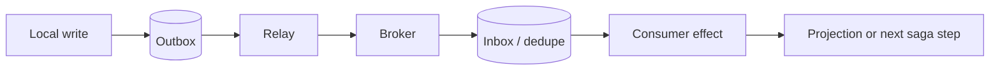

# Data and Messaging

Load this catalog only when ticket signals match this domain. A pattern name is a candidate, not a verdict.

## `database-per-service`: Database per Service

| Judge field | Guidance |
|---|---|
| Pressure | Independent services need ownership and deployment boundaries around their data. |
| Valid use | Bounded contexts require autonomous schemas and accept cross-service consistency costs. |
| Reject when | The system is one cohesive unit or joins/transactions dominate the boundary. |
| Failure modes | Cross-service queries, duplicated data, distributed transactions, weak ownership, migration drift. |
| Required evidence | Bounded contexts, ownership, transaction needs, query paths, consistency tolerance. |
| Adversarial questions | Which invariant can no longer use one local transaction? |
| Simpler default | Shared database with schema/module ownership. |
| Tests | Contract, replication lag, cross-service workflow, and migration tests. |
| Operations | Data freshness, failed syncs, schema ownership, reconciliation. |
| ELI5 | Give each shop its own till only when shops can settle accounts. |

## `saga`: Saga

| Judge field | Guidance |
|---|---|
| Pressure | A business transaction spans independently committed service-local transactions. |
| Valid use | Explicit steps and compensations can preserve business invariants without global ACID. |
| Reject when | One database transaction works, irreversible steps lack remediation, or workflow is trivial. |
| Failure modes | Failed compensation, duplicate steps, stuck state, semantic rollback gaps, orchestration coupling. |
| Required evidence | Step state machine, idempotency, compensation rules, timeout/ownership, audit needs. |
| Adversarial questions | What happens after each possible crash, including compensation failure? |
| Simpler default | Single transaction, workflow table, or manual recovery procedure. |
| Tests | Crash after every step, duplicate/reordered messages, compensation and timeout tests. |
| Operations | Saga age/state, stuck count, compensation failures, operator repair. |
| ELI5 | A group promise needs a checklist for undoing each finished step. |

## `cqrs`: CQRS

| Judge field | Guidance |
|---|---|
| Pressure | Read and write models have genuinely different scaling, shape, security, or consistency needs. |
| Valid use | Independent models solve measured read/write pressure and accepted synchronization lag. |
| Reject when | Small CRUD, shared invariants, or one model serves both paths cleanly. |
| Failure modes | Projection lag, duplicated rules, stale reads, dual schemas, operational burden. |
| Required evidence | Read/write workload asymmetry, model differences, lag tolerance, ownership. |
| Adversarial questions | What measurable pressure cannot one model and indexes solve? |
| Simpler default | Single model with query views or read replicas. |
| Tests | Command invariants, projection rebuild/lag, stale-read, and reconciliation tests. |
| Operations | Projection lag/errors, replay progress, model divergence, storage cost. |
| ELI5 | Use two notebooks only when reading and writing need different pages. |

## `event-sourcing`: Event Sourcing

| Judge field | Guidance |
|---|---|
| Pressure | The system needs authoritative history, temporal reconstruction, or event-native domain behavior. |
| Valid use | Audit/rebuild value outweighs schema evolution, replay, and operational complexity. |
| Reject when | Ordinary current-state storage satisfies needs; audit logs are enough. |
| Failure modes | Bad events become permanent, replay side effects, schema evolution, huge streams, projection drift. |
| Required evidence | Reconstruction/audit requirement, event contract governance, replay plan, concurrency model. |
| Adversarial questions | Can every event evolve and replay without repeating external effects? |
| Simpler default | Current-state tables plus explicit audit history. |
| Tests | Optimistic concurrency, event upcast, replay, snapshot, and projection rebuild tests. |
| Operations | Stream growth, append conflicts, replay duration, projection lag, poison events. |
| ELI5 | Keep every move only when rebuilding the whole game is worth the notebook. |

## `snapshot`: Snapshot

| Judge field | Guidance |
|---|---|
| Pressure | Long event streams make reconstruction too slow. |
| Valid use | Measured replay cost justifies periodic state checkpoints tied to stream version. |
| Reject when | Streams are short or projections already satisfy reads. |
| Failure modes | Stale/corrupt snapshots, incompatible versions, missed events, oversized snapshot writes. |
| Required evidence | Replay latency, stream length, version/checksum scheme, rebuild path. |
| Adversarial questions | How is a snapshot rejected when its stream or schema no longer matches? |
| Simpler default | Replay events or cache a projection. |
| Tests | Corrupt/stale snapshot, schema upgrade, fallback replay, concurrency tests. |
| Operations | Snapshot age/version, restore failures, replay tail length, storage growth. |
| ELI5 | A saved game helps only if it matches the rulebook and remaining moves. |

## `temporal-data`: Temporal Data

| Judge field | Guidance |
|---|---|
| Pressure | Users or rules need to query what data was valid or recorded at a past time. |
| Valid use | Audits, corrections, effective dates, or bitemporal questions are explicit requirements. |
| Reject when | Only current state matters or a simple audit log answers the question. |
| Failure modes | Overlapping validity, timezone errors, retroactive corrections, costly queries, retention conflicts. |
| Required evidence | Temporal query examples, valid/transaction-time rules, retention, indexing plan. |
| Adversarial questions | Which clock is authoritative when facts arrive late or are corrected? |
| Simpler default | Current row plus append-only change history. |
| Tests | Boundary times, overlaps, late facts, correction, timezone, and retention tests. |
| Operations | Temporal query latency, invalid intervals, history growth, correction audit. |
| ELI5 | Keep dated pages when people must ask what was true then. |

## `inbox-pattern`: Inbox Pattern

| Judge field | Guidance |
|---|---|
| Pressure | At-least-once message delivery can repeat consumer work. |
| Valid use | A consumer records message identity atomically with its local effect. |
| Reject when | Effects are naturally idempotent or broker semantics and scope already prevent repeats. |
| Failure modes | Unbounded inbox, wrong dedupe key, retention gaps, non-atomic side effects. |
| Required evidence | Delivery semantics, message identity, duplicate window, local transaction boundary. |
| Adversarial questions | Which effect and dedupe record commit together? |
| Simpler default | Idempotent operation keyed by business identity. |
| Tests | Duplicate, crash-before/after commit, retention-expiry, concurrency tests. |
| Operations | Duplicate rate, inbox growth, key collisions, cleanup lag. |
| ELI5 | Check the guest list before serving the same ticket twice. |

## `transactional-outbox`: Transactional Outbox

| Judge field | Guidance |
|---|---|
| Pressure | A local database change and outgoing message cannot be atomically committed across systems. |
| Valid use | State and outbox row share one local transaction; relay and consumers tolerate duplicates. |
| Reject when | No event is required, broker transaction covers the boundary, or polling cost is unjustified. |
| Failure modes | Duplicate publish, stuck relay, ordering gaps, table growth, poison event, false exactly-once claim. |
| Required evidence | Atomic schema, relay ownership, ordering key, idempotent consumer, backlog SLO. |
| Adversarial questions | Where can duplicates appear, and how are they harmless? |
| Simpler default | Synchronous call with explicit failure, or database-triggered change feed. |
| Tests | Crash at commit/publish boundaries, duplicate, ordering, poison, replay tests. |
| Operations | Outbox age/backlog, publish failures, duplicate rate, cleanup and replay. |
| ELI5 | Write the task on the same receipt, then let a courier retry delivery. |

## `backpressure`: Backpressure

| Judge field | Guidance |
|---|---|
| Pressure | Producers can exceed downstream capacity and unbounded buffering threatens the system. |
| Valid use | A bounded protocol can slow, reject, shed, or signal upstream based on measured capacity. |
| Reject when | Traffic is bounded or a queue with explicit limits already absorbs it. |
| Failure modes | Hidden queues, feedback delay, oscillation, producer ignorance, unfair shedding. |
| Required evidence | Arrival/service rates, queue bounds, latency objective, rejection semantics. |
| Adversarial questions | Where is pressure signaled, and what does each producer do with it? |
| Simpler default | Bounded queue plus concurrency/rate limit. |
| Tests | Sustained overload, burst, slow consumer, recovery, fairness tests. |
| Operations | Queue age/depth, rejects, producer rate, consumer utilization, recovery time. |
| ELI5 | Tell the faucet to slow before the bucket overflows. |

## `work-queue`: Work Queue

| Judge field | Guidance |
|---|---|
| Pressure | Independent asynchronous jobs need buffering and horizontal worker distribution. |
| Valid use | Jobs can be retried/idempotent, bounded, observed, and processed outside request latency. |
| Reject when | Work must complete synchronously, ordering is global, or volume is tiny. |
| Failure modes | Poison jobs, duplicate effects, starvation, unbounded backlog, lost ownership. |
| Required evidence | Job rate/runtime, retry/idempotency, ordering, DLQ, capacity and latency SLO. |
| Adversarial questions | What owns a job after worker death, and when is it abandoned? |
| Simpler default | In-process background task or scheduled batch. |
| Tests | Lease expiry, worker crash, duplicate, poison, priority, drain tests. |
| Operations | Oldest age, depth, attempts, DLQ, throughput, worker saturation. |
| ELI5 | Put chores in a line only when helpers can safely pick them up twice. |

## `soft-delete`: Soft Delete

| Judge field | Guidance |
|---|---|
| Pressure | Records need reversible removal or retained workflow state. |
| Valid use | Business recovery/audit requirements define visibility, retention, and eventual purge. |
| Reject when | Hard deletion is required, retention has no purpose, or every query would risk leakage. |
| Failure modes | Forgotten filters, uniqueness conflicts, zombie relations, data growth, false compliance claims. |
| Required evidence | Retention/legal basis, restore rules, purge workflow, access controls, query inventory. |
| Adversarial questions | Who may see or restore deleted data, and when is it irreversibly purged? |
| Simpler default | Hard delete, status field for domain lifecycle, or separate archive. |
| Tests | Default-scope, restore, uniqueness, cascade, purge, authorization tests. |
| Operations | Deleted count/age, purge failures, hidden-record access, storage growth. |
| ELI5 | Putting a toy in a closet is not throwing it away or satisfying an erasure request. |
