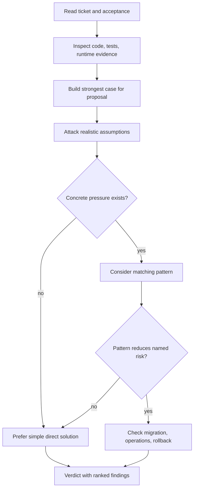
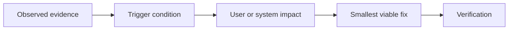

# Sideeye diagrams

## Review decision

## Finding anatomy

## Explain like I'm 5

Follow the arrows like a treasure map. See what exists, find where it can fail, explain why that matters, and test the smallest repair.
