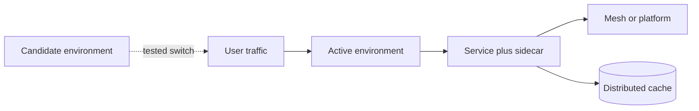

# Infrastructure and Delivery

Load this catalog only when ticket signals match this domain. A pattern name is a candidate, not a verdict.

## `sidecar`: Sidecar

| Judge field | Guidance |
|---|---|
| Pressure | A cross-cutting helper needs separate lifecycle or technology beside each workload. |
| Valid use | Proxy, telemetry, security, or sync behavior benefits from independent deployment and isolation. |
| Reject when | A library/platform feature is simpler or per-instance overhead is unjustified. |
| Failure modes | Resource tax, version skew, startup order, local network failure, opaque behavior. |
| Required evidence | Lifecycle independence, resource budget, failure coupling, deployment ownership. |
| Adversarial questions | Why must this run beside every instance instead of inside or on the platform? |
| Simpler default | Library, daemon, gateway, or managed platform feature. |
| Tests | Startup/order, crash, version skew, resource limit, network tests. |
| Operations | Sidecar readiness, resource use, version fleet, local request failures. |
| ELI5 | Give every worker a helper only when the helper needs its own job and schedule. |

## `service-mesh`: Service Mesh

| Judge field | Guidance |
|---|---|
| Pressure | Many services need uniform transport security, routing, identity, and telemetry policy. |
| Valid use | Fleet scale and platform ownership justify data/control planes and proxy overhead. |
| Reject when | Few services, simple networking, or existing ingress/libraries cover requirements. |
| Failure modes | Control-plane outage, proxy tax, policy opacity, version skew, debugging complexity. |
| Required evidence | Service count, policy needs, latency/resource budget, ownership and migration plan. |
| Adversarial questions | Which fleet-wide policy cannot existing platform controls enforce? |
| Simpler default | Ingress plus libraries or managed service networking. |
| Tests | Policy, mTLS, control-plane loss, proxy failure, upgrade, latency tests. |
| Operations | Proxy/control-plane health, policy rejects, added latency, cert rotation. |
| ELI5 | Build traffic police only when many roads need the same enforceable rules. |

## `strangler-fig`: Strangler Fig

| Judge field | Guidance |
|---|---|
| Pressure | A legacy system must be replaced incrementally without one risky cutover. |
| Valid use | Bounded routes/data can move behind a stable facade with coexistence and retirement plan. |
| Reject when | Rewrite scope is small or boundaries/data ownership cannot be separated. |
| Failure modes | Permanent dual system, routing ambiguity, data divergence, duplicated logic, no retirement. |
| Required evidence | Slice boundaries, traffic routing, data migration, parity tests, removal milestones. |
| Adversarial questions | What exact old path disappears after this slice ships? |
| Simpler default | Modular refactor in place or focused replacement. |
| Tests | Route parity, shadow traffic, rollback, data sync, old-path removal tests. |
| Operations | Traffic by path, parity errors, legacy dependency count, retirement progress. |
| ELI5 | Replace an old house room by room only with a plan to remove every old wall. |

## `externalized-config`: Externalized Config

| Judge field | Guidance |
|---|---|
| Pressure | Deployments need environment-specific values without rebuilding code. |
| Valid use | Typed, validated, access-controlled config changes have explicit rollout semantics. |
| Reject when | Values are constants, secrets need a dedicated store, or central config adds outage risk. |
| Failure modes | Invalid runtime change, drift, secret leakage, unavailable config store, incompatible versions. |
| Required evidence | Change frequency, ownership, validation schema, bootstrap/fallback, secret classification. |
| Adversarial questions | What happens when config is missing, stale, invalid, or changed mid-request? |
| Simpler default | Versioned deploy-time environment/config file. |
| Tests | Schema, missing value, stale cache, rollout/rollback, permission tests. |
| Operations | Config version/drift, fetch errors, validation failures, change audit. |
| ELI5 | Move knobs outside the machine only when they are labeled and guarded. |

## `failover`: Failover

| Judge field | Guidance |
|---|---|
| Pressure | Availability targets require serving after an instance, zone, or region failure. |
| Valid use | Redundant capacity, replicated state, fencing, detection, and tested recovery meet explicit RTO/RPO. |
| Reject when | Downtime is acceptable or standby state cannot be kept safely consistent. |
| Failure modes | Split brain, stale promotion, data loss, false health, capacity shortfall, failback risk. |
| Required evidence | Failure model, RTO/RPO, replication lag, fencing, capacity and exercise results. |
| Adversarial questions | What data can be lost, who fences the old primary, and how is failback done? |
| Simpler default | Restart/restore from backup or single-region redundancy. |
| Tests | Crash, partition, stale replica, capacity, failback, data reconciliation tests. |
| Operations | Detection/promotion time, lag, data loss, split-brain signals, drill cadence. |
| ELI5 | A spare captain helps only if one captain controls the ship and charts agree. |

## `consistent-hashing`: Consistent Hashing

| Judge field | Guidance |
|---|---|
| Pressure | Keys must be partitioned while nodes join or leave with limited remapping. |
| Valid use | Large distributed caches/stores need stable distribution and virtual-node balancing. |
| Reject when | A managed cluster already shards, node set is stable, or simple modulo is sufficient. |
| Failure modes | Hotspots, skew, uneven virtual nodes, replica movement, incompatible hash changes. |
| Required evidence | Key distribution, churn rate, hotspot profile, replication and migration protocol. |
| Adversarial questions | How much remapping and imbalance occurs for real keys and failures? |
| Simpler default | Managed partitioner or static range/modulo partitioning. |
| Tests | Node add/remove, skew, hotspot, hash-version, replica placement tests. |
| Operations | Load/keys per node, remap rate, hotspot latency, rebalance progress. |
| ELI5 | Use a round table so adding a chair moves fewer place cards. |

## `blue-green-deployment`: Blue-Green Deployment

| Judge field | Guidance |
|---|---|
| Pressure | A release needs controlled traffic switch between two production-like environments. |
| Valid use | Capacity and compatibility permit parallel environments and tested traffic reversal. |
| Reject when | Stateful/schema changes are not backward compatible or duplicate capacity is wasteful. |
| Failure modes | Data divergence, hidden shared dependency, stale warmup, unsafe rollback, cost. |
| Required evidence | Traffic switch, schema compatibility, state ownership, warmup, rollback window. |
| Adversarial questions | Which changes cannot be reversed after new code writes data? |
| Simpler default | Rolling or canary deployment with feature flags. |
| Tests | Pre-switch smoke, traffic shift, rollback, schema compatibility, state reconciliation tests. |
| Operations | Version traffic, errors/latency, warmup, rollback duration, environment drift. |
| ELI5 | Two stages help swap actors; they do not undo lines already written in the ledger. |

## `distributed-cache`: Distributed Cache

| Judge field | Guidance |
|---|---|
| Pressure | Repeated reads overload the source or miss latency targets across many instances. |
| Valid use | Measured hit potential and bounded staleness justify shared cache operations. |
| Reject when | Database/index tuning or local cache meets goals; correctness needs fresh data. |
| Failure modes | Stale reads, stampede, hot keys, eviction, failover loss, invalidation races. |
| Required evidence | Read profile, hit target, staleness budget, invalidation, source fallback, memory sizing. |
| Adversarial questions | What stale answer is acceptable, and what happens when cache is empty or partitioned? |
| Simpler default | Optimize source query, local bounded cache, or no cache. |
| Tests | Miss/stampede, invalidation race, eviction, failover, hot-key tests. |
| Operations | Hit ratio, age, evictions, memory, source load, failover data loss. |
| ELI5 | A shared shortcut saves time, but its copy can be old or disappear. |

## `anti-corruption-layer`: Anti-Corruption Layer

| Judge field | Guidance |
|---|---|
| Pressure | An external or legacy model would leak into and distort a domain model. |
| Valid use | A translation boundary protects stable domain language from independently changing systems. |
| Reject when | Models already align or a thin adapter is enough. |
| Failure modes | Duplicated semantics, lossy mapping, stale translation, oversized boundary, hidden coupling. |
| Required evidence | Model mismatches, ownership, version churn, mapping rules, error semantics. |
| Adversarial questions | Which foreign concept is translated, rejected, or intentionally lost? |
| Simpler default | Focused adapter or explicit mapping at one boundary. |
| Tests | Version, missing/unknown field, round-trip/loss, failure translation tests. |
| Operations | Mapping errors, unknown values, upstream version use, translation latency. |
| ELI5 | Use an interpreter when two teams speak different languages, not when names merely differ. |
