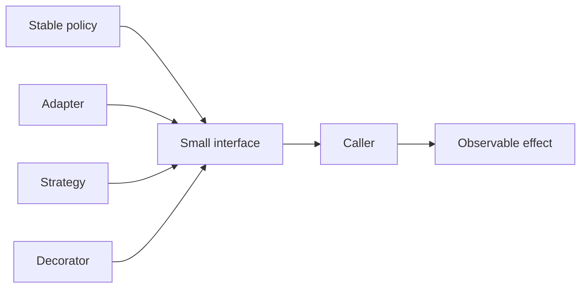

# Object Design

Load this catalog only when ticket signals match this domain. A pattern name is a candidate, not a verdict.

## `single-responsibility`: Single Responsibility Principle

| Judge field | Guidance |
|---|---|
| Pressure | A unit changes for unrelated actors or policies. |
| Valid use | Separating responsibilities reduces independent change coupling. |
| Reject when | Reasons to change are cohesive or splitting would create chatty fragments. |
| Failure modes | Tiny-class sprawl, misplaced boundaries, data shuttling, fake cohesion. |
| Required evidence | Change history, ownership, dependency and test boundaries. |
| Adversarial questions | Which independent actor causes this unit to change? |
| Simpler default | Keep cohesive code together; extract only the independent policy. |
| Tests | Change-focused unit tests and dependency-boundary tests. |
| Operations | Churn/co-change, ownership, defect clusters. |
| ELI5 | Give one helper one kind of job, not one line of work. |

## `open-closed`: Open/Closed Principle

| Judge field | Guidance |
|---|---|
| Pressure | Expected variation repeatedly edits stable core logic. |
| Valid use | A real extension axis can add behavior behind a stable contract. |
| Reject when | Variation is speculative or simple conditionals are clearer. |
| Failure modes | Plugin maze, frozen bad abstraction, scattered extension contracts. |
| Required evidence | Repeated variation examples, stable invariant, extension ownership. |
| Adversarial questions | What new case arrives without editing the stable policy? |
| Simpler default | Direct conditional or table-driven mapping. |
| Tests | Existing behavior plus new extension and unknown-case tests. |
| Operations | Extension inventory, compatibility failures, contract versions. |
| ELI5 | Add a new puzzle piece only when the board edge is truly stable. |

## `liskov-substitution`: Liskov Substitution Principle

| Judge field | Guidance |
|---|---|
| Pressure | Subtypes violate expectations of callers using a base type. |
| Valid use | Behavioral contracts allow interchangeable implementations. |
| Reject when | Types are not substitutable concepts or inheritance is only reuse. |
| Failure modes | Strengthened preconditions, weakened results, surprise exceptions/state. |
| Required evidence | Base contract, caller expectations, subtype behavior and invariants. |
| Adversarial questions | Can every subtype replace the base without caller branching? |
| Simpler default | Composition or separate types with honest contracts. |
| Tests | Shared contract suite across every implementation. |
| Operations | Contract violations, subtype-specific branches, exception drift. |
| ELI5 | Any replacement toy should fit and behave where the original did. |

## `interface-segregation`: Interface Segregation Principle

| Judge field | Guidance |
|---|---|
| Pressure | Consumers depend on methods they never use or cannot implement. |
| Valid use | Distinct client capabilities justify smaller cohesive interfaces. |
| Reject when | Splitting mirrors every method or increases coordination without independence. |
| Failure modes | Interface explosion, adapter boilerplate, hidden capability combinations. |
| Required evidence | Consumer method usage, change coupling, capability boundaries. |
| Adversarial questions | Which consumer is forced to know or fake which operation? |
| Simpler default | Concrete type or one cohesive interface. |
| Tests | Per-interface contract and consumer compile/integration tests. |
| Operations | Interface churn, no-op implementations, adapter count. |
| ELI5 | Give each worker the controls they need, not every button in the building. |

## `dependency-inversion`: Dependency Inversion Principle

| Judge field | Guidance |
|---|---|
| Pressure | Stable policy directly depends on volatile implementation details. |
| Valid use | A boundary lets policy own the contract and supports real alternatives/tests. |
| Reject when | No volatility/alternative exists or framework injection adds ceremony. |
| Failure modes | Leaky abstractions, interface per class, service locator, runtime wiring errors. |
| Required evidence | Policy/implementation change rates, alternate adapters, test seam. |
| Adversarial questions | Does policy define the contract, and which detail can change independently? |
| Simpler default | Direct dependency with focused constructor injection. |
| Tests | Policy tests with fakes plus adapter contracts and wiring tests. |
| Operations | Wiring failures, adapter versions, boundary leaks. |
| ELI5 | Let the recipe choose the tool shape, not the tool rewrite the recipe. |

## `singleton`: Singleton

| Judge field | Guidance |
|---|---|
| Pressure | Process-wide identity is a true invariant and lifecycle must be controlled. |
| Valid use | One instance is required, immutable/controlled, and concurrency/test reset are solved. |
| Reject when | It is merely convenient shared state or multiple scopes/processes exist. |
| Failure modes | Hidden coupling, test leakage, contention, initialization order, false global uniqueness. |
| Required evidence | Invariant scope, lifecycle, thread safety, multi-process behavior. |
| Adversarial questions | Why exactly one per what boundary, and who resets or replaces it? |
| Simpler default | Explicit instance passed by composition or container scope. |
| Tests | Concurrent init, lifecycle, reset, multi-process and dependency tests. |
| Operations | Initialization failures, contention, instance lifecycle. |
| ELI5 | Use one town clock only when everyone truly shares one town. |

## `factory-method`: Factory Method

| Judge field | Guidance |
|---|---|
| Pressure | Construction varies by type, environment, or policy and callers should not know concrete classes. |
| Valid use | Several real implementations share a stable product contract. |
| Reject when | One constructor exists or selection is a simple local expression. |
| Failure modes | Hidden dependencies, string switches, oversized factories, invalid products. |
| Required evidence | Concrete variants, selection rules, product contract, ownership. |
| Adversarial questions | What variation is hidden, and can every product satisfy one contract? |
| Simpler default | Constructor or small named creation function. |
| Tests | Selection, invalid configuration, product contract, dependency tests. |
| Operations | Creation failures, selected type, config/version drift. |
| ELI5 | Ask a workshop to choose the right tool only when choices really differ. |

## `builder`: Builder

| Judge field | Guidance |
|---|---|
| Pressure | Construction has many optional steps, ordering, or cross-field invariants. |
| Valid use | A readable staged API prevents invalid complex objects. |
| Reject when | The object has few fields or language literals/defaults are clear. |
| Failure modes | Invalid partial state, order dependence, mutable reuse, verbose ceremony. |
| Required evidence | Parameter count, optional combinations, invariants, call-site readability. |
| Adversarial questions | Which invalid state does the builder make impossible? |
| Simpler default | Constructor, options object, named arguments, or defaults. |
| Tests | Required field, invalid combination, reuse, immutability tests. |
| Operations | Construction validation failures and deprecated option use. |
| ELI5 | Use assembly instructions only when the toy has enough pieces to need them. |

## `adapter`: Adapter

| Judge field | Guidance |
|---|---|
| Pressure | Existing interfaces genuinely mismatch across a boundary. |
| Valid use | Translation isolates a third-party/legacy contract from callers. |
| Reject when | Only names differ or caller can use the source API directly. |
| Failure modes | Leaky source semantics, lossy conversion, version drift, exception mismatch. |
| Required evidence | Source/target contracts, mapping rules, version support, error semantics. |
| Adversarial questions | What semantic mismatch, beyond spelling, does this translate? |
| Simpler default | Direct call or small mapping function. |
| Tests | Mapping, unknown value, version, error and round-trip tests. |
| Operations | Translation errors, upstream versions, unmapped fields. |
| ELI5 | Use a plug adapter when sockets differ, not to rename the plug. |

## `decorator`: Decorator

| Judge field | Guidance |
|---|---|
| Pressure | Independent behaviors must compose around one contract at runtime. |
| Valid use | Order-aware wrappers add orthogonal capabilities without changing core behavior. |
| Reject when | Behavior is fixed, one wrapper exists, or order is unsafe/opaque. |
| Failure modes | Deep stacks, order bugs, duplicate effects, hidden latency, identity confusion. |
| Required evidence | Composition cases, order semantics, shared contract, performance budget. |
| Adversarial questions | Which combinations are real, and does order change meaning? |
| Simpler default | Direct composition or explicit pipeline. |
| Tests | Contract, order permutation, duplicate wrapper, failure and latency tests. |
| Operations | Wrapper depth/order, per-layer latency/errors. |
| ELI5 | Wrap a gift in layers only when each layer has a clear independent purpose. |

## `facade`: Facade

| Judge field | Guidance |
|---|---|
| Pressure | A complex subsystem needs a stable, narrow entry for a specific use case. |
| Valid use | A cohesive workflow hides incidental subsystem sequencing. |
| Reject when | The facade becomes a god service or merely forwards calls. |
| Failure modes | Overbroad API, hidden transactions, duplicated policy, blocked advanced use. |
| Required evidence | Client workflows, subsystem volatility, ownership, escape hatches. |
| Adversarial questions | Which complexity is incidental to clients, and what stays visible? |
| Simpler default | Direct module API or focused orchestration function. |
| Tests | Workflow, partial failure, compatibility and advanced-path tests. |
| Operations | Facade latency/errors, dependency fan-out, API growth. |
| ELI5 | Use one reception desk for a building, not one person to do every job. |

## `proxy`: Proxy

| Judge field | Guidance |
|---|---|
| Pressure | Access needs remote indirection, authorization, laziness, caching, or lifecycle control. |
| Valid use | The stand-in preserves contract while making boundary behavior explicit. |
| Reject when | A direct object works and indirection would hide important effects. |
| Failure modes | Surprise network/latency, stale cache, identity differences, access bypass. |
| Required evidence | Boundary purpose, contract compatibility, failure/latency semantics. |
| Adversarial questions | Can callers tell which costly or failing behavior the proxy adds? |
| Simpler default | Direct reference or explicit service/client API. |
| Tests | Contract, access, remote failure, cache/lazy and identity tests. |
| Operations | Proxy latency/errors, cache age, denied access, target health. |
| ELI5 | A stand-in is useful only when everyone knows what it guards or delays. |

## `strategy`: Strategy

| Judge field | Guidance |
|---|---|
| Pressure | Several algorithms vary independently behind the same outcome contract. |
| Valid use | Multiple live choices need runtime/config selection and shared tests. |
| Reject when | One implementation is permanent or a small conditional is clearer. |
| Failure modes | Weak common contract, strategy explosion, configuration errors, duplicated setup. |
| Required evidence | Algorithms, selection pressure, common input/output/invariants. |
| Adversarial questions | What changes independently, and how are results comparable? |
| Simpler default | Function parameter, lookup table, or conditional. |
| Tests | Shared contract, selection, unknown strategy and equivalence tests. |
| Operations | Selected strategy, failures/latency by strategy, config drift. |
| ELI5 | Swap game plans only when there are real plans to choose from. |

## `observer`: Observer

| Judge field | Guidance |
|---|---|
| Pressure | Multiple independent reactions should follow an event without source knowing each consumer. |
| Valid use | Subscribers tolerate event timing, ordering, and failure semantics. |
| Reject when | A direct explicit call graph is small and clearer. |
| Failure modes | Hidden synchronous chain, leaks, ordering races, duplicate reactions, silent failures. |
| Required evidence | Subscriber set, delivery model, ordering, error isolation, lifecycle. |
| Adversarial questions | What happens when one observer is slow, fails, or registers twice? |
| Simpler default | Direct calls or explicit orchestrator. |
| Tests | Subscribe/unsubscribe, order, duplicate, failure isolation, reentrancy tests. |
| Operations | Subscriber count, handler failures/latency, dropped events. |
| ELI5 | Ring a bell for many listeners only when missed or repeated rings are handled. |

## `command`: Command

| Judge field | Guidance |
|---|---|
| Pressure | An operation needs queueing, logging, retries, undo, transport, or deferred execution. |
| Valid use | Action identity and lifecycle are first-class requirements. |
| Reject when | A direct function call suffices and no lifecycle capability exists. |
| Failure modes | Class-per-action sprawl, stale captured state, unsafe retry/undo, hidden dispatch. |
| Required evidence | Required lifecycle capability, payload/version, idempotency, handler ownership. |
| Adversarial questions | What must happen to this action besides executing once now? |
| Simpler default | Function or explicit request object. |
| Tests | Serialize/version, execute, duplicate, undo/compensation and dispatch tests. |
| Operations | Command age/attempts, handler errors, unknown versions. |
| ELI5 | Put a chore on a card only when it must travel, wait, or be undone. |

## `state`: State

| Judge field | Guidance |
|---|---|
| Pressure | Behavior changes by a finite, explicit lifecycle with constrained transitions. |
| Valid use | State-specific behavior and transition rules replace scattered conditionals. |
| Reject when | Only data labels change or a simple switch is clearer. |
| Failure modes | Invalid transitions, state-class sprawl, persistence mismatch, hidden side effects. |
| Required evidence | State graph, transition invariants, persistence/concurrency model. |
| Adversarial questions | Which transitions are illegal, and where are they enforced atomically? |
| Simpler default | Enum plus switch/table and explicit transition function. |
| Tests | Every transition, illegal transition, concurrent update, restore tests. |
| Operations | State distribution, invalid attempts, stuck-state age. |
| ELI5 | Use rule cards for each game phase only when phases truly change play. |

## `template-method`: Template Method

| Judge field | Guidance |
|---|---|
| Pressure | An algorithm skeleton is stable while selected steps vary in subclasses. |
| Valid use | Controlled inheritance and invariant step order are genuine requirements. |
| Reject when | Composition is feasible or subclasses need to replace most steps. |
| Failure modes | Fragile base class, hook order coupling, inheritance lock-in, hidden calls. |
| Required evidence | Stable sequence, variation points, subclass count, invariant enforcement. |
| Adversarial questions | Which steps must never move, and why inheritance over composition? |
| Simpler default | Function composition or strategy pipeline. |
| Tests | Base invariant, hook order, each subclass contract and failure tests. |
| Operations | Subclass usage, hook failures, base changes. |
| ELI5 | Use a fixed recipe with replaceable steps only when order is sacred. |

## `chain-of-responsibility`: Chain of Responsibility

| Judge field | Guidance |
|---|---|
| Pressure | Ordered handlers may consume, transform, or pass a request. |
| Valid use | Pipeline order and stop/continue semantics are explicit and observable. |
| Reject when | A direct call or small conditional is clearer. |
| Failure modes | Invisible order, swallowed requests, multiple handling, mutation coupling, debug difficulty. |
| Required evidence | Handler order, termination rules, ownership, traceability. |
| Adversarial questions | Who guarantees exactly one intended outcome and shows where the chain stopped? |
| Simpler default | Explicit pipeline loop or ordered conditional. |
| Tests | Order, stop/pass, no-handler, multiple-handler, mutation and failure tests. |
| Operations | Handler path, stop reason, per-handler latency/errors. |
| ELI5 | Pass a note down a line only when everyone knows when to stop. |
