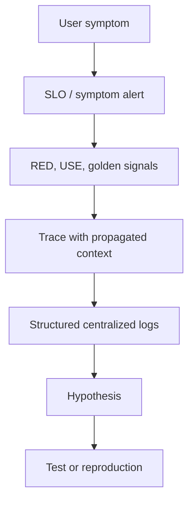

# Observability and Operations

Load this catalog only when ticket signals match this domain. A pattern name is a candidate, not a verdict.

## `structured-logging`: Structured Logging

| Judge field | Guidance |
|---|---|
| Pressure | Machines and operators need reliable fields for querying and correlation. |
| Valid use | Stable event schemas capture decisions, identifiers, outcomes, and bounded context. |
| Reject when | A metric or trace is the better signal; prose adds no action. |
| Failure modes | Schema drift, high cardinality, sensitive data, duplicate/noisy events. |
| Required evidence | Investigation queries, field schema, data classification, volume/retention. |
| Adversarial questions | Which operator question does each field answer without parsing prose? |
| Simpler default | Focused metric/event or plain error with stable context. |
| Tests | Schema, redaction, cardinality, serialization, failure-path tests. |
| Operations | Ingest errors, volume, field presence, sensitive-data audits. |
| ELI5 | Use labeled boxes so helpers can sort notes without guessing sentences. |

## `log-levels-sampling`: Log Levels and Sampling

| Judge field | Guidance |
|---|---|
| Pressure | High-volume logs obscure signal or exceed cost while rare failures need detail. |
| Valid use | Severity and sampling policy preserve actionable events and error exemplars. |
| Reject when | Volume is low or deterministic audit records must never be sampled. |
| Failure modes | Dropped rare failures, biased samples, level misuse, cost surprises. |
| Required evidence | Volume by event/level, investigation needs, audit exclusions, sampling math. |
| Adversarial questions | Which event must never be sampled, and can operators estimate true volume? |
| Simpler default | Remove useless events or emit a metric. |
| Tests | Sampling distribution, always-keep errors, level threshold, audit tests. |
| Operations | Drop/sample counts, ingest cost, event mix, policy changes. |
| ELI5 | Keep every fire alarm, sample routine footsteps, and count what you skipped. |

## `correlation-ids`: Correlation IDs

| Judge field | Guidance |
|---|---|
| Pressure | Operators need to join work belonging to one request or business operation. |
| Valid use | A stable identifier propagates across synchronous and asynchronous boundaries. |
| Reject when | One component handles the work or trace context already supplies the join. |
| Failure modes | Missing/overwritten IDs, spoofing, cardinality, confused retries, PII leakage. |
| Required evidence | Boundary map, ID origin/trust, retry semantics, log/trace field rules. |
| Adversarial questions | Does the ID follow fan-out, queues, retries, and untrusted clients safely? |
| Simpler default | Use standard trace/span context or explicit business operation ID. |
| Tests | Ingress generation, propagation, async, retry, spoofing and redaction tests. |
| Operations | Missing-ID rate, duplicate/collision checks, boundary coverage. |
| ELI5 | Put the same safe ticket number on every note for one job. |

## `distributed-tracing`: Distributed Tracing

| Judge field | Guidance |
|---|---|
| Pressure | A request crosses boundaries and latency/failure attribution is otherwise opaque. |
| Valid use | Critical paths need sampled spans with useful attributes and controlled cost. |
| Reject when | One process serves requests or metrics/logs already answer the question. |
| Failure modes | Broken context, sampling gaps, sensitive attributes, cardinality, instrumentation latency. |
| Required evidence | Critical path, sampling policy, attribute schema, cost, trace retention. |
| Adversarial questions | Which decision will a trace enable that metrics cannot, and what remains unsampled? |
| Simpler default | Targeted timers and correlation IDs. |
| Tests | Parent/child, errors, async propagation, sampling, redaction tests. |
| Operations | Sampling/ingest rate, broken traces, span latency/errors, cost. |
| ELI5 | Follow footprints across rooms, knowing some trails are sampled. |

## `trace-context-propagation`: Trace Context Propagation

| Judge field | Guidance |
|---|---|
| Pressure | Trace identity must survive service, queue, and process boundaries. |
| Valid use | Standard trace context is injected/extracted with explicit trust and async linking. |
| Reject when | No boundary exists or a single-process tracer handles it. |
| Failure modes | Broken chains, accepting malicious context, duplicate roots, wrong parentage. |
| Required evidence | Boundary inventory, W3C/OpenTelemetry behavior, trust limits, messaging semantics. |
| Adversarial questions | Where is context created, validated, forwarded, linked, or intentionally dropped? |
| Simpler default | Local spans or one correlation ID. |
| Tests | HTTP, queue, fan-out, retry, invalid header, trust-boundary tests. |
| Operations | Orphan/root rate, propagation errors, boundary coverage, baggage size. |
| ELI5 | Pass a safe thread through rooms so footprints stay one trail. |

## `four-golden-signals`: Four Golden Signals

| Judge field | Guidance |
|---|---|
| Pressure | A service needs a compact health view of latency, traffic, errors, and saturation. |
| Valid use | User-serving systems can define each signal with actionable thresholds. |
| Reject when | The workload is not request-oriented or domain signals are more relevant. |
| Failure modes | Misdefined errors, averages hiding tails, missing saturation, dashboard without action. |
| Required evidence | Service contract, demand, latency distribution, error semantics, limiting resource. |
| Adversarial questions | Which signal shows user pain, and which capacity limit explains it? |
| Simpler default | Start with one user outcome SLI and one bottleneck measure. |
| Tests | Metric calculation, missing data, tail latency, overload and alert tests. |
| Operations | Dashboard/alert ownership, label cardinality, SLO links. |
| ELI5 | Watch speed, visitors, mistakes, and how full the room is. |

## `red-method`: RED Method

| Judge field | Guidance |
|---|---|
| Pressure | Request-driven services need rate, errors, and duration visibility. |
| Valid use | Every request boundary has stable definitions and latency distributions. |
| Reject when | Batch/resource workloads need different primary signals. |
| Failure modes | Counting retries twice, bad denominator, average duration, status misclassification. |
| Required evidence | Request boundary, success/error definition, histogram buckets, dimensions. |
| Adversarial questions | What is one request, and which failures count from the user view? |
| Simpler default | One SLI plus targeted service metrics. |
| Tests | Counter/histogram math, retries, status mapping, missing telemetry tests. |
| Operations | Rate/error/duration dashboards, burn alerts, cardinality. |
| ELI5 | Count how many orders arrive, fail, and how long they take. |

## `use-method`: USE Method

| Judge field | Guidance |
|---|---|
| Pressure | A resource may limit work through utilization, saturation, or errors. |
| Valid use | CPU, memory, disks, pools, and queues have measurable capacity boundaries. |
| Reject when | Managed resources expose better service-level signals or no action follows. |
| Failure modes | Wrong capacity denominator, hidden queues, sampling blind spots, host/container mismatch. |
| Required evidence | Resource inventory, capacity units, queue/error sources, ownership. |
| Adversarial questions | What is the resource limit, and what action follows sustained saturation? |
| Simpler default | Measure the known bottleneck plus user symptoms. |
| Tests | Capacity math, overload, queue, error, container/host attribution tests. |
| Operations | Utilization/saturation/errors by resource, capacity changes, alert runbook. |
| ELI5 | See how busy, backed up, and broken each machine part is. |

## `percentiles`: Percentiles Over Averages

| Judge field | Guidance |
|---|---|
| Pressure | Latency or size distributions have tails hidden by averages. |
| Valid use | Enough observations and correct histograms support p50/p95/p99 decisions. |
| Reject when | Sample volume is tiny or percentile aggregation is mathematically invalid. |
| Failure modes | Mismerged client percentiles, sparse noise, bad buckets, omitted errors/timeouts. |
| Required evidence | Histogram method, sample count, aggregation scope, SLO threshold. |
| Adversarial questions | Can these percentiles aggregate across instances and include timeouts correctly? |
| Simpler default | Histogram/SLO threshold with counts; show average only for totals. |
| Tests | Known distribution, bucket boundary, sparse window, merge and timeout tests. |
| Operations | Sample count, bucket coverage, quantile error, tail trend. |
| ELI5 | Do not call a class fast because the middle child finished quickly. |

## `liveness-readiness`: Health Check API and Liveness/Readiness

| Judge field | Guidance |
|---|---|
| Pressure | Platforms need separate answers for process recovery and traffic eligibility. |
| Valid use | Checks are cheap, bounded, and reflect the action the orchestrator will take. |
| Reject when | The process exits on failure, no orchestrator consumes checks, or dependency checks would cascade. |
| Failure modes | Restart loops, fleet-wide unready state, expensive probes, false health, dependency amplification. |
| Required evidence | Orchestrator behavior, startup time, essential dependencies, thresholds, failure history. |
| Adversarial questions | Will this result restart the process or only remove traffic, and is that safe at fleet scale? |
| Simpler default | Process exit plus simple readiness/startup signal. |
| Tests | Deadlock, overload, dependency loss, startup, timeout and fleet-cascade tests. |
| Operations | Probe latency/failures, restarts, unready duration, rollout impact. |
| ELI5 | One check asks "alive?"; another asks "ready for customers?" |

## `symptom-alerts`: Symptom Alerts

| Judge field | Guidance |
|---|---|
| Pressure | On-call should page for user-visible harm rather than every internal cause. |
| Valid use | SLI/SLO burn or direct user outcome supports actionable urgency. |
| Reject when | No user symptom can be measured yet; exploratory cause metrics belong on dashboards. |
| Failure modes | Late detection, noisy proxy, missing low-volume users, duplicate pages. |
| Required evidence | User journey, SLI, threshold/window, ownership, runbook and urgency. |
| Adversarial questions | What user is hurt now, and what can the responder do immediately? |
| Simpler default | Ticket/nonpage cause signals; one direct symptom alert. |
| Tests | Known incident replay, low/high traffic, missing data, recovery and dedupe tests. |
| Operations | Page precision/recall, burn rate, acknowledgments, false-positive review. |
| ELI5 | Ring the bell when customers feel trouble, then inspect gauges for why. |

## `slis-slos-error-budgets`: SLIs, SLOs, and Error Budgets

| Judge field | Guidance |
|---|---|
| Pressure | Teams need a measurable reliability target and explicit trade-off with change velocity. |
| Valid use | A user-centered SLI, target/window, and agreed budget policy guide decisions. |
| Reject when | A target has no owner, measurement, or consequence. |
| Failure modes | Vanity SLI, impossible target, hidden exclusions, budget gaming, policy ignored. |
| Required evidence | User journey, measurement validity, historical baseline, business target, policy. |
| Adversarial questions | Which decision changes when budget burns, and who agreed to that policy? |
| Simpler default | Start with one critical journey and report performance before paging. |
| Tests | SLI math, missing data, window, burn, exclusion and policy simulation tests. |
| Operations | Budget remaining/burn, SLO attainment, policy actions, review cadence. |
| ELI5 | Set how many misses are tolerable, then slow changes when allowance is gone. |

## `dashboards-as-code`: Dashboards as Code

| Judge field | Guidance |
|---|---|
| Pressure | Operational views need reviewable, reproducible, versioned definitions. |
| Valid use | Teams manage dashboards through tested deployment with data-source contracts. |
| Reject when | One temporary exploration or vendor UI export adds more friction than value. |
| Failure modes | Broken queries, environment drift, noisy diffs, inaccessible generated output. |
| Required evidence | Ownership, version workflow, provisioning, query tests, rollback limits. |
| Adversarial questions | Can a reviewer detect a broken query before deployment and reproduce the view? |
| Simpler default | Documented manual dashboard for small stable scope. |
| Tests | Parse/schema, query smoke, data-source, deploy and visual checks. |
| Operations | Provision failures, stale dashboards, query errors, version adoption. |
| ELI5 | Keep the control panel blueprint when many copies must stay alike. |

## `centralized-logs`: Centralized Logs

| Judge field | Guidance |
|---|---|
| Pressure | Operators need cross-service search, retention, and access control for event records. |
| Valid use | Structured, redacted logs have defined ingestion, indexing, retention, and cost. |
| Reject when | Local logs or traces/metrics cover the small system. |
| Failure modes | Ingest loss, cost explosion, sensitive exposure, index lag, vendor outage. |
| Required evidence | Query use cases, volume, schema, retention, access and fallback. |
| Adversarial questions | Which logs may be lost, delayed, redacted, or unavailable during an incident? |
| Simpler default | Local bounded logs plus targeted export. |
| Tests | Ingest outage, backpressure, redaction, retention, access, query tests. |
| Operations | Ingest lag/loss, cost, index errors, access audit, retention. |
| ELI5 | Put labeled notes in one guarded library, but plan for lost deliveries. |

## `synthetic-monitoring`: Synthetic Monitoring

| Judge field | Guidance |
|---|---|
| Pressure | Critical user journeys need proactive checks independent of real traffic. |
| Valid use | A stable representative journey can run safely from relevant locations. |
| Reject when | The flow mutates real data unsafely, depends on brittle UI details, or real-user monitoring is enough. |
| Failure modes | False positives, test-data pollution, blocked bots, blind locations, credential risk. |
| Required evidence | Critical journey, locations, test account/data, frequency, alert/runbook. |
| Adversarial questions | Which real failure does this catch, and can the check itself cause harm? |
| Simpler default | API health/SLI check or real-user monitoring. |
| Tests | Success/failure, timeout, dependency fault, cleanup, credential rotation tests. |
| Operations | Success/latency by location, false positives, cleanup failures, credential expiry. |
| ELI5 | Send a safe pretend customer through the shop before real customers complain. |
